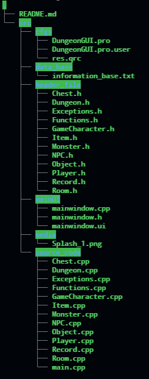

# A Little game with GUI
##### Depends on the QT creator
- [Download](https://www.dropbox.com/s/wutklbz251xibkn/DungeonGUI_Individual.exe?dl=0)

## Code Structure

> tree structure of codes.

## Description:
- Enter the name and try to explore the dungeon!
    - Beat the KING OF DUNGEON to win the game
    - If you die, the game is over...
- The Map, NPCs, and Monsters are all random
- Set the Hard level to process the game
    - 1: easy   (about 8 mins)
    - 2: common (about 15 mins)
    - 3: hard   (about 30 mins)
    - 4: very hard (??????????)
- The format of initialize a player is: [Player_name] \[Difi: int]
    - For example: John Difi 2

## Update:

- 2021, 4, 20:
    - A dungeon game with flashscreen and save, load, exception handle
    - The game has aloready have a complete procrdure

- 2021, 4, 23:
    - Append the **Coin System**
        1. Now, buy the commodity will no more cost the health!
        2. The price of the commodities will raise with the index of the rooms
        3. Beat the Monster to earn the coins.
    - Change the window title
    - Change the Image of the Splash Window
- 2021, 8, 18
    - Append [DropBox download](https://www.dropbox.com/s/wutklbz251xibkn/DungeonGUI_Individual.exe?dl=0)
- 2021, 10, 29
    - Upload source codes.